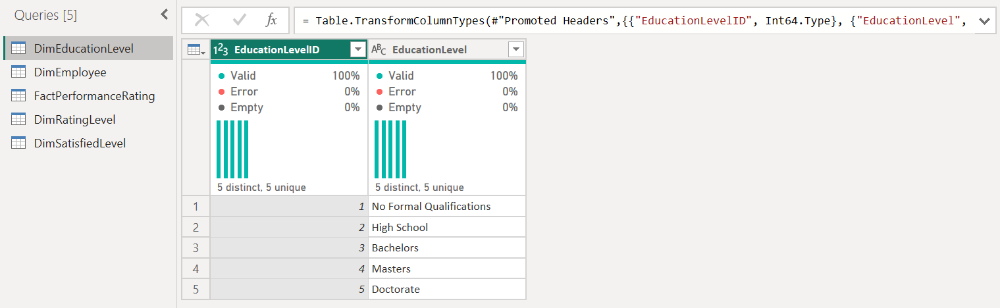
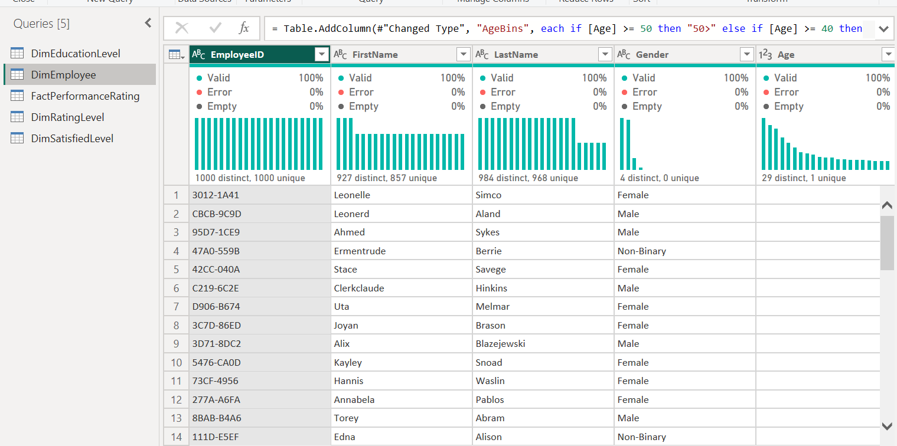
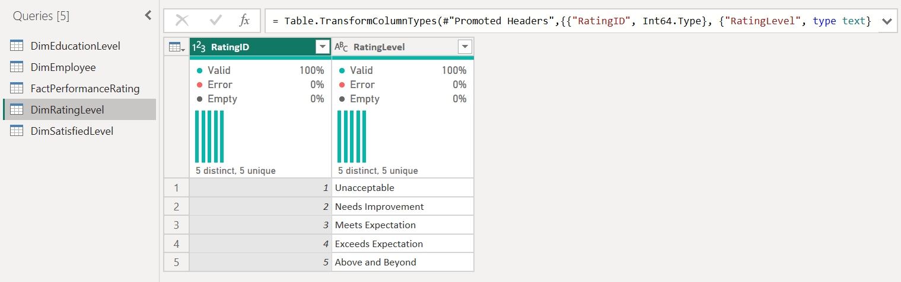
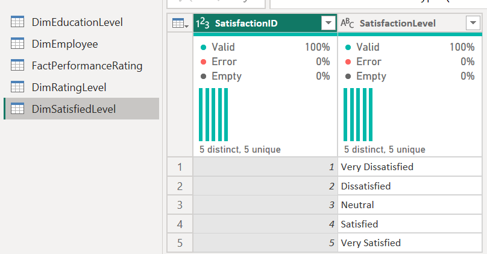
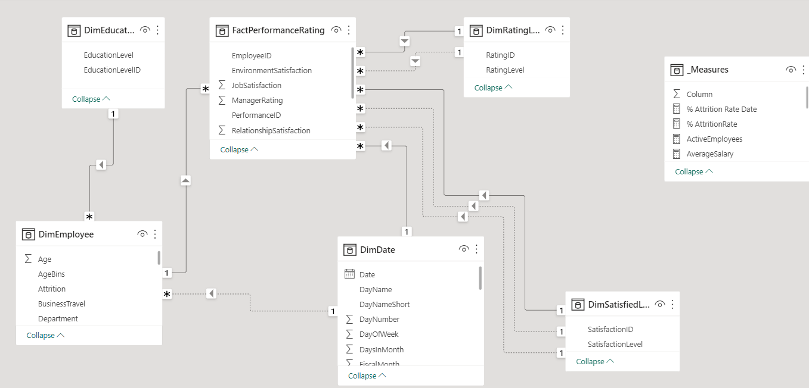
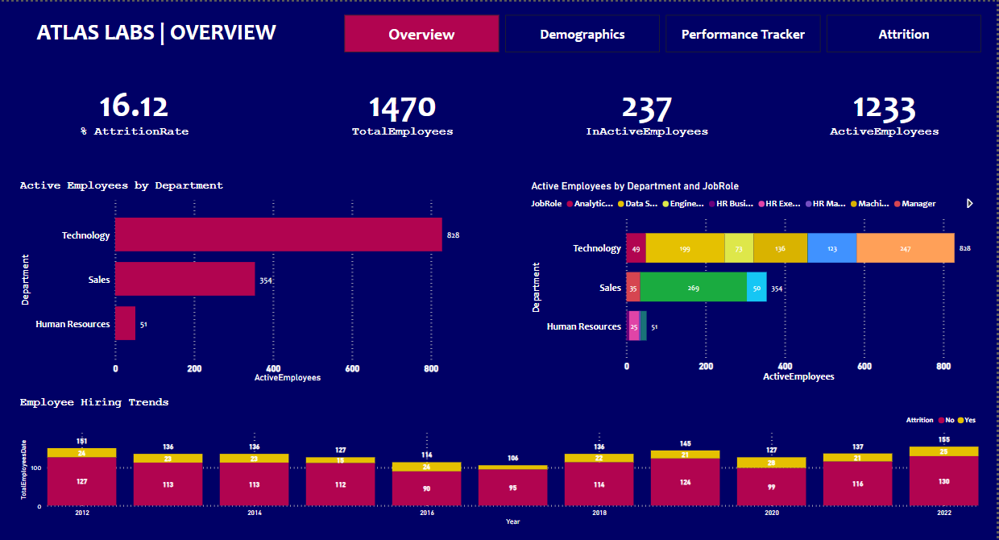
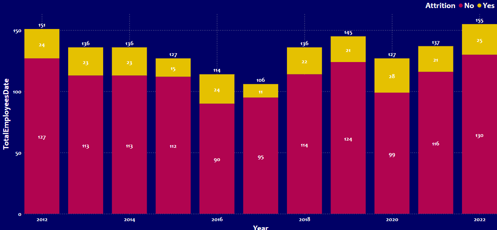
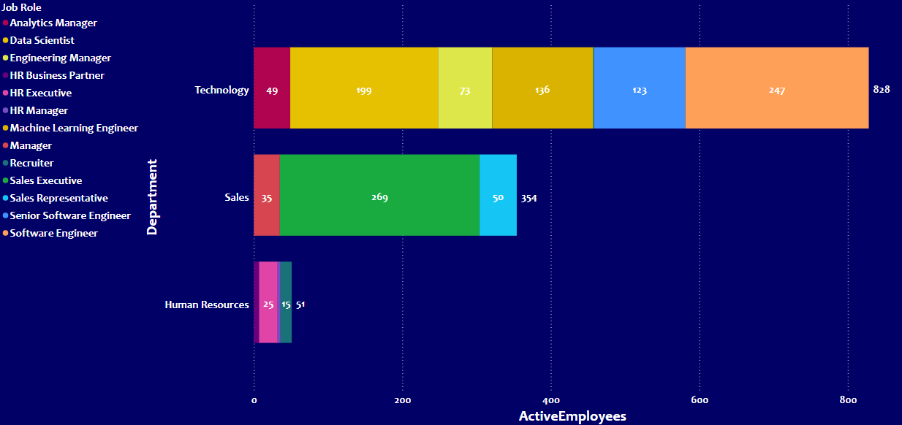
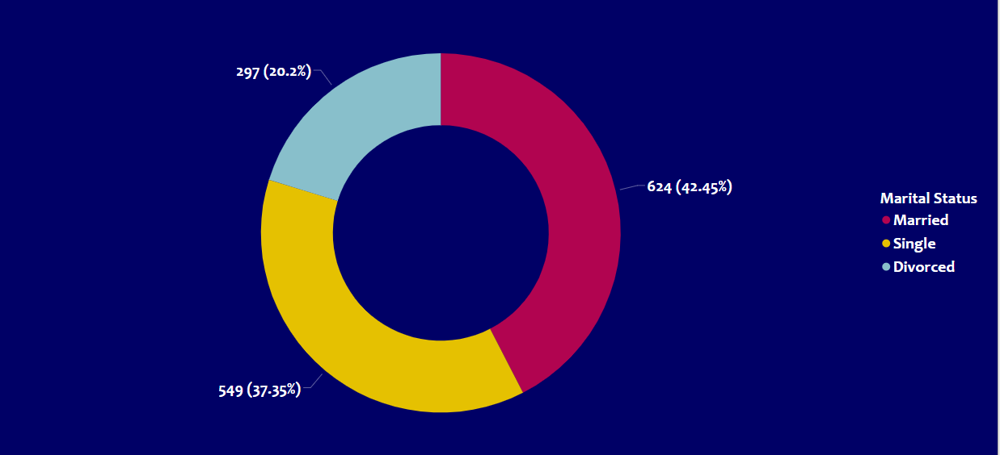
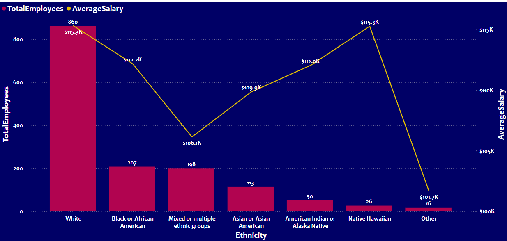

# HR-Analytics

## Introduction

  The core goal of this case study is to build a report using a fictitious dataset from a tech company atlas lab, the HR team want to be able to monitor key metrics on employees
  
### Primary goal:
Monitor key HR metrics on employees
### Secondary goal:  
Understand what factors impact attrition

### Skills Demonstrated
1) DAX
2) Data Modelling
3) Data Visualization

### Data Sourcing

**_Disclaimer_** : This is a dummy dataset, mainly for the purpose of learning.

1) Educationallevel.csv
2) Employee.csv
3) Performancerating.csv
4) RatingLevel.csv
5) SatistifiedLevel.csv

  “Fact” OR “Dim” were added at the beginning of each table name, depending on its type. All newly loaded tables were reviewed , and the columns are correctly formatted as text, numbers , and dates as expected in the metadata sheet.

## Data Transformation

Data cleaning was performed per table. The table appeared to be clean. The quality of each column is 100% with no error or nulls. Below is a preview of the tables:

---
 
---
  
---

--- 

## Date dimension and relating tables
  In a Power BI report, a dedicated date table is highly recommended for accurate date and time reporting. Modelling data is one of the four pillars of Power Bi report development as it enables us to connect different data tables together in the form of a star or snow schema.

## Data Model Design
  The data required for this analysis are located in various tables. Therfore, appropriate modelling is required. A star Schema is designed with the FactPerformance table representing the fact table containing all redundant data, and to which other dimension tables are modelled or connected to, using the column that is common. FactPerformance Table has been modelled. Having a many to one or one to many relationship with its dimension tables. Some relationship in the model are not active. This was activated using USERELATIONSHIP() function in DAX.  
  
  

1) FactperformanceRating Table using the "PerformanceID"
2) DimEmployee Table using the "EmployeeID"
3) Dimeducation Table using "EducationLevelID"
4) DimRatingLevel Table via "RatingID"
5) DimDate Table via  "Date"
6) DimSatisfiedLevel Table via "SatisfactionID"

## Date dimension and relating tables
In a Power BI report, a dedicated date table is highly recommended for accurate date and time reporting. Modelling data is one of the four pillars of Power Bi report development as it enables us to connect different data tables together in the form of a star or snow schema.

## Data Analyst / Visualization

 The leadership team at Atlas Labs is looking to have visibility on high-level metrics about the sate of its employees, in particular, the organization is looking to understand the attrition at the company.
My goal is to explore the available data and calculate this key measure that will be useful throughout the case study.

### Exloring the Data

1) Create a new empty table called _Measure
2) Create two measures: ActiveEmployees and InactiveEmployees inside the _Measures tables, which takes count of all employees that are currently active or inactive, respectively, we will use DimEmployee[Attrition] to determine whether an employee is inactive.
3) Calculate % Attrition Rate based on the previous measures as a percentage with 1 decimal place

  

### Hiring Trends over time

  The head of HR request for a report to be created that enables them to have a view of the whole organization’s key metrics. This will enable them to be able to benchmark their HR metrics against organizations across their industry as well as understand how their employees are performing.
I would start by analyzing the hiring trends over time to see where the biggest growth in new employees.
We will be looking to activate relationships between tables. In this case , DimDate already has an active relationship with FactPerformanceRating. Therefore we will need to utilize USERRELATIOSHIP() to count the number of employees by date.

Step 1 : Create a stacked column chart to show TotalEmployees by Date, the result wont be insightful, simply because it has an inactive relationship. We will activate it.
Step 2 : We will replace the TotalEmployees in our chart with our newly created TotalEmployeesDate
Step 3 : Attrition to be added to the chart to see the split of employees by active vs inactive.

  

### Analyzing departments and job roles.
The HR team is working with department managers to understand their teams and what type of typical roles they are hiring into the organization. This will enable every department to plan for new hiring requests in the future.

	Step 1 : Create a Clustered bar chart to show ActiveEmployees by Department and Job role.

  

### Key Insights Uncovered
1)	Atlas Labs has employed over 1470 people
2)	At the point which the data was collect, Atlas Labs had over 1200 employees.
3)	The largest department by far is Technology.
All these can raise questions, is atlas labs competitive enough as a employer
4)	The attrition rate for employees leaving the organization is 16% ( The question here would be: what impacts employees happiness or satisfaction?)

   

## Analyzing Demographics and Performance

Now we will use Power Bi to extract insights using DAX and build custom visuals that we can use throughout our report. We will need insights on our employees’ demographics and performance.
We now have a good understanding of the general hiring trends, its important to look at the next layer of key HR metrics that focus on diversity and inclusion

### Demographic Marital Status and ethnicity
1) An appropriate visualization that displays a count of all employees by marital status was selected
2) An AverageSalary measure inside the _Measures table, which works out the average salary of all employees was created
3) An appropriate visualization that displays the count of all employees and their average salary by ethnicity was worked on

  

  

### Performance Tracker: Part 1

We have already created two pages of metrics that help us understand our general HR status as well where we sit from a diversity and inclusion perspective.
	Now the HR team would like to have a vies where they can continually track an individual employees performance scores based on their yearly performance reviews.

1) We will create a new page in the report called “Performance Tracker”.
2) I will create a a calculated column ‘FULLNAME” in the DimEmployee table that combines FirstName and LastName
3) I will create a slicer that will be able to filter the report page based on the employee’s Fullname.
4) I will create a card visual that displays the selected employees hiredate
5) I will create a measure LastReviewDate that gets the last performance review for the selected individual
6) I will create a measure NextReviewDate that calculates when the next review is due. It should be 365 dats after the LastReviewDate.
7) I will display the measure on a card visual.
8) Lets look for the next review date for Estelle chung for functionality purpose.

### Key insights uncovered
1)	Majority of employees are between 20-29 years old
2)	Currently, Atlas Labs employ 2.7% more women than women
Employees who identify as 

1)	Non-binary make up 8.5% of total employees
2)	White have the highest average salary
3)	Mixed or multiple ethnic groups have one of the lowest salaries

### Recommendation for HR
Review travel requirement policy and survey employees on feeling around travel frequency.

